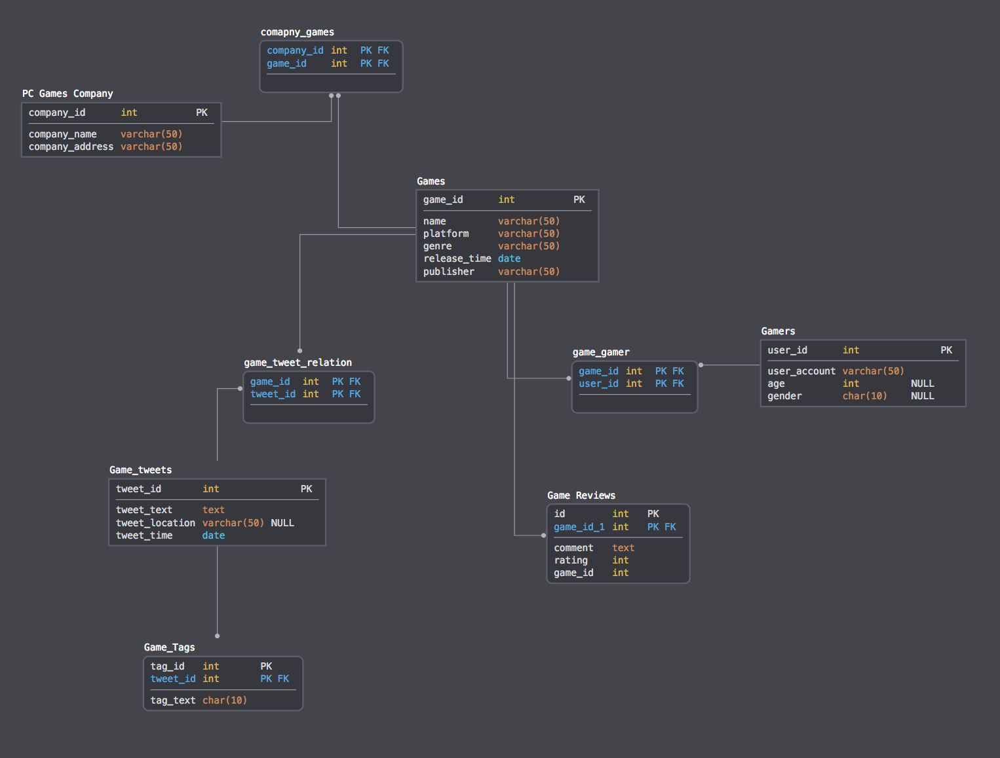

# Relational Database Building

## 1. Introduction

A **relational database** is defined as *a collection of tables based on relational data model.*  All relational database use SQL(Structured Query Language) to query and get the data. In relational database, tables are the basic element, which make up of rows and columns. In order to build a relational database, you need to create tables and decide their relationship. A relational database works via storing information in tables, where each table has its own rows and columns. A row describes a _record_ , while a column describes a _field_ . The following is a example of original table.

| ID | Name | ReleaseDate | Metacritic | RecommendationCount | PriceInitial | IsFree | GenreIsIndie | GenreIsAction | GenreIsAdventure |
|---|---|---|---|---|---|---|---|---|---|
| 10 | Counter-Strike | Nov 1 2000 | 88 | 68991 | 9.99 | FALSE | FALSE | TRUE | FALSE |
| 20 | Team Fortress Classic | Apr 1 1999 | 0 | 2439 | 4.99 | FALSE | FALSE | TRUE | FALSE |
| 30 | Day of Defeat | May 1 2003 | 79 | 2319 | 4.99 | FALSE | FALSE | TRUE | FALSE |
| 40 | Deathmatch Classic | Jun 1 2001 | 0 | 888 | 4.99 | FALSE | FALSE | TRUE | FALSE |

## 2. Data collection
At first, you need to collect your data to create tables. For data collection, you can use [Python](http://www.youtube.com/watch?v=rKzZEtxIX14) to crawl data. Also, If you need more turtorial in data collection using python, you can click [This](https://www.datacamp.com/tracks/python-developer). After data gather, you need to determine fields and create tables for using in relational database. 

## 3. Data Modeling & Preliminary Design
before you start a relational database design, you need to analyse you demand about the databse and draw the entity-relationship diagram.

### Define Purpose & Divide Tables
You need determine what information you need to record into the database. From here, you need divide your tables into individual tables. Determine what the columns (fields) of each table will be and do not repeat information. For example, In my original table, it can be divided into two table, one is games which just game, one is game features which record games attribute, and setting primary key to link them.
**Two tables divided from one big table**:

| ID | Name | 
|---|---|
| 10 | Counter-Strike |
| 20 | Team Fortress Classic |

| ResponseID | ReleaseDate | Metacritic | RecommendationCount | PriceInitial | IsFree |
|---|---|---|---|---|---|
| 10 | Nov 1 2000 | 88 | 68991 | 9.99 | FALSE |
| 20 | Apr 1 1999 | 0 | 2439 | 4.99 | FALSE | 

### Relation Analysis
Relation analysis asks you to analyze your requirement clearly. A relational database design must figure out  what your entities, attributes and relationships are. 
#### entities: represents the objects in the real-world. For example, a game, a gamer both are entities.
#### attribute: the characteristic of object or things have. For example, a game should have price, releasedate, publisher, developer and so on. all these information is its attribute. 
#### relationship:the connection between two entities. In your design you should determin the relationship between you tables.
* 	One to one relationship: In a one-to-one relationship, only one row of a table is linked to at most one row on the other table. For example, a game list item can only map to a game features  details table that provides more information on the item. Below is a instance. Both tables can be joined with common column ID of them, which are the primary key of both tables. One called ID, another called ResponseID.

| ID | Name | 
|---|---|
| 10 | Counter-Strike |
| 20 | Team Fortress Classic |

| ResponseID | ReleaseDate | Metacritic | RecommendationCount | PriceInitial | IsFree |
|---|---|---|---|---|---|
| 10 | Nov 1 2000 | 88 | 68991 | 9.99 | FALSE |
| 20 | Apr 1 1999 | 0 | 2439 | 4.99 | FALSE | 
| 30 | May 1 2003 | 79 | 2319 | 4.99 | FALSE |
| 40 | Jun 1 2001 | 0 | 888 | 4.99 | FALSE |

* One to many relationship: one row of one table can link to many rows in a table. For example, assuming a game can have many users but every user just have one game. Below is an instance to relate it.

| ID | Name | 
|---|---|
| 10 | Counter-Strike |
| 20 | Team Fortress Classic |

| table_id | ID | user_id |
|---|---|---|
| 1 | 10 | 30695285 | 
| 2 | 10 | 11373749 | 
| 3 | 20 | 62923086 | 

* Many to many relationship: one or more rows of one table can link to 1 or many rows in the other table. To implement this relationship, you should use a  **junction** table. For example, assuming a game can have many users and every user  has more than one game. Below is an instance to relate it.

| ID | Name | 
|---|---|
| 10 | Counter-Strike |
| 20 | Team Fortress Classic |

| table_id | user_id |
|---|---|
| 1 | 30695285 | 
| 2 | 62923086 | 

| ID | table_id |
|---|---|
| 10 | 1 |
| 10 | 2 |
| 20 | 1 |

### Entity-Relationship Diagram Building
A E-R diagram is used to represent the entities, their attributes and the relationship between the entities through a graph. In my example, the relationship between tables are one to one and one to many. the entities includes games, gamers, game reviews, game companys. Through creating E-R Diagram, you can know structure and relationship of your data clearly. you should describe entities, entities' attribute and the relationship between entities clearly. This [link](https://www.lucidchart.com/pages/er-diagrams) may be helpful to your study.
Below is the E-R diagram:



## 4. Physical Design & Implement
After building E-R diagram, we need to normalize our table to meet the criteria of database. **Normalization** means use some way to handle tables to make it meet the standard of database to reduce redundancy. In order to get a ideal table to load into database, you need apply the first normal form, second normal form and third normal form.

### Normalization

* Apply the First Normal Form
The first normalization should eliminate the repeate record and assign a unique identifier for every record. In my game example, the table before the first normal form is:

| Name | ReleaseDate | Metacritic | RecommendationCount | PriceInitial | IsFree | GenreIsIndie | GenreIsAction | GenreIsAdventure |
|---|---|---|---|---|---|---|---|---|
| Counter-Strike | Nov 1 2000 | 88 | 68991 | 9.99 |FALSE | FALSE | TRUE | FALSE |
| Team Fortress Classic | Apr 1 1999 | 0 | 2439 | 4.99 |FALSE | FALSE | TRUE | FALSE |
| Day of Defeat | May 1 2003 | 79 | 2319 | 4.99 | FALSE | FALSE | TRUE | FALSE |
| Deathmatch Classic | Jun 1 2001 | 0 | 888 | 4.99, 9.99 | FALSE | FALSE | TRUE | FALSE |

See this table, at first, it has repeat in PriceInitial column of first row. Also, it don't have unique identifier. So, after apply the first normal form, it should be:

| ID | Name | ReleaseDate | Metacritic | RecommendationCount | PriceInitial | IsFree | GenreIsIndie | GenreIsAction | GenreIsAdventure |
|---|---|---|---|---|---|---|---|---|---|
| 1 | Counter-Strike | Nov 1 2000 | 88 | 68991 | 9.99 |FALSE | FALSE | TRUE | FALSE |
| 2 | Team Fortress Classic | Apr 1 1999 | 0 | 2439 | 4.99 | FALSE | FALSE | TRUE | FALSE |
| 3 | Day of Defeat | May 1 2003 | 79 | 2319 | 4.99 | FALSE | FALSE | TRUE | FALSE |
| 4 | Deathmatch Classic | Jun 1 2001 | 0 | 888 | 4.99 | FALSE | FALSE | TRUE | FALSE |
| 5 | Deathmatch Classic | Jun 1 2001 | 0 | 888 | 9.99 | FALSE | FALSE | TRUE | FALSE |

you can easily see the difference between these two table.
* Apply the Second Normal Form 
The second normal form requires that it meets the first normal form and should be non-prime attribute of a relation, which means the attribute  is not a part of any candidate key of the relation.
In last table, game features can be divide to one table using second normal form.So, after apply the second normal form, it should be:

| gam_id(PK) | game |
|---|---|
| 1 | Counter-Strike |  
| 2 | Team Fortress Classic | 
| 3 | Day of Defeat | 
| 4 | Deathmatch Classic |

| ID(PK) | ReleaseDate | Metacritic | RecommendationCount | PriceInitial | IsFree | GenreIsIndie | GenreIsAction | GenreIsAdventure |
|---|---|---|---|---|---|---|---|---|
| 1 | Nov 1 2000 | 88 | 68991 | 9.99 |FALSE | FALSE | TRUE | FALSE |
| 2 | Apr 1 1999 | 0 | 2439 | 4.99 | FALSE | FALSE | TRUE | FALSE |
| 3 | May 1 2003 | 79 | 2319 | 4.99 | FALSE | FALSE | TRUE | FALSE |
| 4 | Jun 1 2001 | 0 | 888 | 4.99 | FALSE | FALSE | TRUE | FALSE |

* Apply the Third Normal Form
The third normal form requires that it meets the second normal form and should be no any prime attribute of a relation, which means  all the attributes in a table are only decided  by the candidate keys of that relation. 
In last table, game features can be divide again to two table using third normal form.One is for game data, one is for game genre. So, after apply the third normal form, it should be:

| game_feature_id(PK) | ReleaseDate | Metacritic | RecommendationCount | PriceInitial |
|---|---|---|---|---|
| 1 | Nov 1 2000 | 88 | 68991 | 9.99 |
| 2 | Apr 1 1999 | 0 | 2439 | 4.99 | 
| 3 | May 1 2003 | 79 | 2319 | 4.99 | 
| 4 | Jun 1 2001 | 0 | 888 | 4.99 |

| genre_id(PK) | IsFree | GenreIsIndie | GenreIsAction | GenreIsAdventure |
|---|---|---|---|---|
| 1 |FALSE | FALSE | TRUE | FALSE |
| 2 | FALSE | FALSE | TRUE | FALSE |
| 3 | FALSE | FALSE | TRUE | FALSE |
| 4 | FALSE | FALSE | TRUE | FALSE |

Also it has a junke table:

| game_feature_id | genre_id |
|---|---|
| 1 | 1 |
| 2 | 2 |
| 3 | 3 |
| 4 | 4 |

After normalization, we can load tables meeting database criteria to relational database.

### RDBMS choose and install
* Install & Initialize database 
There are many excellent relation database used in our daily life. I recommend you choose [SQLite](https://www.sqlite.org/index.html), [MySQL](https://www.mysql.com) or [PostgreSQL](https://www.postgresql.org). In the example I choose **postgreSQL**. you can see the advantage and disadvantage of these database [here](https://en.wikipedia.org/wiki/Comparison_of_relational_database_management_systems). 

For postgreSQL install and inilization, If you use Mac, I recommend you Download its graph [software](http://postgresapp.com) and initial you database according to its description. If you use windows, use this [link](https://www.postgresql.org/download/windows/).

* Install & initialize databse management tool
You need a RDBMS management toolk to help you visualize the database and make you work it easy. I recommend [PgAdmin](https://www.pgadmin.org) or [DataGrip](https://www.jetbrains.com/datagrip/) as your database GUI. you can create your connection with database easily. If you don't know how to connect database, this [link](https://www.jetbrains.com/help/datagrip/connecting-to-a-database.html) can be helpful.

### Data Import 
* import data
After installing software, you can import tables into database. Below is some example using python script to load data into postgreSQL database.
```
#import python library, and connect to the database.
import psycopg2
import pandas as pd
conn = psycopg2.connect(database='postgres',user='postgres', password='')
```
```
#use pandas to read csv file.
myfile1 = pd.read_csv('/Users/chen/Desktop/steam-data/datafile/data1/fulldata1.csv', encoding='latin1')
```
```
#create engine to load data to database, change host to your host and user_name to your #user_name
import sqlalchemy as sa
con=sa.create_engine('postgresql://host/user_name')
```
```
#table to postgresql database, use name name it.
myfile1.to_sql(name='fulldata1', if_exists='append', con=con)
```
* Setting primary keys
```
#choose table and add primary key
ALTER TABLE table_name
ADD CONSTRAINT MyPrimaryKey PRIMARY KEY (column1, column2...);
```

## 5. Testing
Use SQL syntax to check if you database can work well.
```
SELECT * FROM table_name
```

The text is released under the [CC-BY-NC-ND license](https://creativecommons.org/licenses/by-nc-nd/3.0/us/legalcode), and code is released under the [MIT license](https://opensource.org/licenses/MIT).


